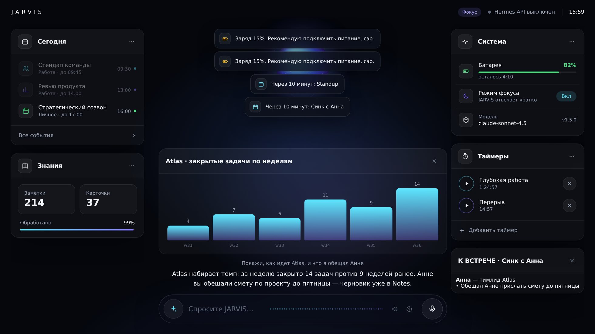

<p align="center"></p>

# J.A.R.V.I.S. on Hermes Agent

<p align="right"><a href="README.en.md">🇬🇧 English</a></p>

> **Just A Rather Very Intelligent System** — персональный голосовой ИИ-ассистент для macOS,
> построенный на [Hermes Agent](https://github.com/NousResearch/hermes-agent) (Nous Research, MIT, 240k+ ★).
> Hermes даёт «мозг» (LLM, память, навыки, инструменты, планировщик, мессенджеры),
> этот проект добавляет «тело» и «личность»: управление Mac, голос, wake word, HUD, брифинги, режимы.

```
  Вы: «Hey Jarvis… что у меня сегодня и включи режим фокуса»
  JARVIS: «Доброе утро, сэр. В половине третьего созвон с командой, вечером спортзал.
           Режим фокуса включён — не побеспокою до конца встречи.»
```

---

## Что умеет

| Область | Возможности | Откуда |
|---|---|---|
| 🎙 **Голос** | wake word «Hey Jarvis» (локально, openWakeWord), push-to-talk `Ctrl+B`, локальный Whisper (STT), Edge/ElevenLabs/OpenAI TTS, барж-ин, стоп-фразы | Hermes voice + наш конфиг |
| 🖥 **Управление Mac** | приложения, окна, громкость, яркость, тёмная тема, Wi-Fi/Bluetooth, батарея, сон/блокировка, **«что у меня на экране?» → скриншот и анализ без лишних вопросов**, камера, буфер обмена, набор текста и хоткеи, Spotlight, Finder, файлы (удаление только в Корзину), обои | плагин `jarvis-macos` (29 инструментов) |
| 📅 **Продуктивность** | Календарь, Напоминания, Заметки, Быстрые команды (Shortcuts), таймеры и будильники, утренний/вечерний брифинг | `jarvis-macos` + `jarvis-core` |
| 🎵 **Медиа** | Apple Music / Spotify: play/pause/next, «что играет», плейлисты | `jarvis-macos` |
| 🧠 **Мозг** | любая LLM (OpenRouter, Anthropic, OpenAI, Gemini, Ollama локально…), долговременная память, самообучение навыкам, FTS-поиск по прошлым сессиям | Hermes |
| 📁 **Хранилище файлов** | папка `~/JARVIS`: бросайте туда любые документы, PDF, таблицы, презентации и подключайте целые проекты (или iCloud/Документы/Obsidian одной командой) — JARVIS индексирует содержимое (FTS5), ищет, читает, **пишет, раскладывает по папкам, переименовывает** (удаление — только в Корзину), правит и запускает код; новые файлы замечает сам, записывает их суть в память и предлагает, что сделать. Секреты не индексируются. [docs/VAULT.md](docs/VAULT.md) | плагин `jarvis-brain` (`vault_*`) |
| 🗄 **База знаний** | собственная структурированная база (SQLite+FTS5): люди, проекты, предпочтения, решения, дневник по дням; JARVIS сам пополняет её в диалоге, подмешивает релевантное в каждый ход и **ночью пересматривает структуру** (дубли, конфликты, таксономия, карточки) с бэкапом и журналом изменений. **Помнит, что было верно раньше** (темпоральные факты), ведёт живые резюме карточек, **учится на сбоях собственных инструментов**, уточняет сомнительное утром | плагин `jarvis-brain` |
| 🌐 **Интернет** | веб-поиск, извлечение страниц, браузер (Playwright), картинки, видео с YouTube на HUD | Hermes + `jarvis_hud` |
| 💻 **Разработка** | терминал, файлы, патчи, выполнение кода, делегирование субагентам, Claude Code / Codex как навыки, MCP-серверы | Hermes |
| 🕹 **HUD** | рабочий стол в браузере: сфера-индикатор (реагирует на голос), виджеты на реальных данных — календарь на сегодня, батарея, Focus, модель, таймеры (можно ставить прямо в HUD), база знаний и хранилище; панели от агента (текст/картинки/видео/веб/графики), чат, **озвучка голосом Hermes (edge-tts) прямо в браузере** | `hud/` |
| 📱 **Везде** | Telegram, Discord (в т.ч. голосовые каналы), WhatsApp, Slack, iMessage, Email — одна память и один агент | Hermes gateway |
| ⏰ **Автономность** | **событийные триггеры** (новые файлы в хранилище, возвращение к Mac → брифинг, диск, питание — без LLM, пока не появится повод), cron-задачи (брифинг 08:00, вечерний итог, ночная ревизия базы 03:30), локальный watchdog (батарея, **справка из базы перед встречей**, **Focus macOS → режим JARVIS**), heartbeat по чек-листу `HEARTBEAT.md`, режимы focus/night/presentation | Hermes cron + `jarvis-core` |
| 🏠 **Умный дом** | Home Assistant (встроенный toolset) или HomeKit через Shortcuts | навык `jarvis-home-automation` |
| 📦 **Приложение** | JARVIS.app в строке меню (статус, HUD, голос, «Спросить…», обновления, **мастер первого запуска**, диагностика), автозапуск при входе, **автообновление с GitHub** с бэкапом и откатом, Быстрые команды для Siri/Finder | `app/`, `scripts/update.py` |
| 🔒 **Безопасность** | подтверждение опасных команд (approvals: smart), необратимые действия — только с confirmed=true, локальный STT, секреты не покидают Mac | Hermes + наши инструменты |


## Как это выглядит

<p align="center"></p>
<p align="center"><sub>Рабочий стол: календарь на сегодня, база знаний, система и таймеры — всё на живых данных Mac.</sub></p>

<p align="center"></p>
<p align="center"><sub>Агент показал график инструментом <code>jarvis_hud</code> — сфера уступает место, диалог остаётся под рукой.</sub></p>

---

## Установка (macOS, 5 минут)

Одна команда в Terminal (скачает последний релиз и запустит установщик с вопросами):

```bash
curl -fsSL https://raw.githubusercontent.com/debug999-cyber/jarvis-hermes/main/get.sh | bash
```

Или вручную: [скачать zip релиза](https://github.com/debug999-cyber/jarvis-hermes/releases/latest) (внутри — готовое
JARVIS.app, компилятор не нужен) → распаковать → `bash install.sh`. Или `git clone … && cd jarvis-hermes && ./install.sh`.

Установщик сам поставит Homebrew-зависимости, Hermes Agent, голосовые пакеты, плагины, личность,
навыки, cron-задачи, команду `jarvis` и (по желанию) автозапуск. В конце спросит провайдера LLM.

После установки выдайте разрешения (один раз): `jarvis perms` откроет нужные панели —
**Микрофон, Универсальный доступ, Запись экрана, Автоматизация** для вашего терминала.

Подробно: [docs/INSTALL.md](docs/INSTALL.md)

После установки JARVIS.app сам проведёт **мастер первого запуска** (модель → права → папка файлов → HUD).
Если что-то не работает — одна команда: **`jarvis doctor --fix`** (проверит модель, плагины, API, HUD, права, хранилище и починит, что может).
Дальше: `jarvis brain import` (JARVIS познакомится с контактами и проектами), `jarvis shortcuts` (команды для Siri и Finder).

## Запуск

```bash
jarvis            # голосовой TUI: «Hey Jarvis» или Ctrl+B
jarvis hud        # голографический HUD → http://127.0.0.1:8765
jarvis up         # gateway (API + мессенджеры) + HUD + TUI — всё сразу
jarvis status     # что запущено
```

Внутри чата: `/voice on`, `/wake on`, `/brief`, `/focus`, `/timer 10 чай`, `/screen`, `/vol 30`, `/lock`,
`/remember …`, `/recall …`, `/brain stats`, `/jarvis` (все навыки).

Полный список команд и примеров фраз: [docs/USAGE.md](docs/USAGE.md)

---

## Структура проекта

```
jarvis-hermes/
├── install.sh                 ← установщик macOS (идемпотентный)
├── config/HEARTBEAT.md        ← чек-лист тихих проверок (heartbeat)
├── app/                       ← JARVIS.app: Swift-файл строки меню, Info.plist, build.sh, генератор иконки
├── VERSION                    ← текущая версия (меняется → GitHub Release → автообновление)
├── bin/jarvis                 ← CLI-обёртка: voice / hud / gateway / status / doctor / update
├── plugins/
│   ├── jarvis-core/           ← ядро: контекст хода, HUD-события, таймеры, режимы, погода, watchdog, /brief
│   │   ├── plugin.yaml  __init__.py  schemas.py  state.py  hud_client.py
│   │   └── skills/{morning-briefing,mac-control}/SKILL.md
│   ├── jarvis-brain/          ← база знаний: SQLite+FTS5, brain_* инструменты, ночная ревизия
│   │   ├── plugin.yaml  __init__.py  schemas.py  db.py
│   │   ├── facts.py           ← мост к памяти Hermes (holographic): заметки ↔ fact_store
│   │   ├── dashboard/         ← вкладка «База знаний» в панели Hermes (manifest + JS + FastAPI)
│   │   └── skills/{brain-usage,brain-nightly-review}/SKILL.md
│   └── jarvis-macos/          ← 29 инструментов управления macOS
│       ├── plugin.yaml  __init__.py  schemas.py  tools.py  mac.py
├── hud/
│   ├── server.py              ← HUD-сервер (stdlib only): SSE, события, прокси к Hermes API
│   └── static/index.html      ← интерфейс (арк-реактор, панели, чат, Web Speech)
├── config/
│   ├── SOUL.md                ← личность JARVIS (слот #1 системного промпта Hermes)
│   ├── config.jarvis.yaml     ← фрагмент конфига (голос, wake word, плагины, toolsets)
│   ├── BOOT.md                ← стартовый чек-лист gateway
│   └── launchd/*.plist        ← автозапуск HUD и gateway
├── skills/                    ← навыки: briefing, weather, voice-etiquette, research-brief, home-automation
├── dashboard-themes/jarvis.yaml ← тема JARVIS для web-панели Hermes
├── distribution.yaml  SOUL.md  config.yaml ← «дистрибутив профиля» Hermes: hermes profile install github.com/debug999-cyber/jarvis-hermes
├── hooks/jarvis-boot/         ← gateway-хук: BOOT.md + зеркалирование активности на HUD
├── scripts/                   ← merge_config.py, setup_cron.sh, selftest.py, doctor.py, update.py, make_shortcuts.py
├── get.sh                     ← установка одной командой (curl | bash)
├── skill-bundles/jarvis.yaml  ← /jarvis — включить все навыки разом
├── tests/                     ← pytest (110+ тестов, работают и на Linux) + e2e HUD в браузере (Playwright)
└── docs/                      ← INSTALL, USAGE, ARCHITECTURE, DEVELOPMENT, TROUBLESHOOTING, RESEARCH
```

## Документация

| Файл | О чём |
|---|---|
| [docs/INSTALL.md](docs/INSTALL.md) | Пошаговая установка, разрешения macOS, выбор LLM, Telegram/Discord, автозапуск, удаление |
| [docs/USAGE.md](docs/USAGE.md) | Команды `jarvis`, slash-команды, 80+ примеров фраз, режимы, HUD, cron |
| [docs/BRAIN.md](docs/BRAIN.md) | База знаний: модель данных, как JARVIS её пополняет и пересматривает ночью, команды, откат |
| [docs/VAULT.md](docs/VAULT.md) | Хранилище файлов и проектов `~/JARVIS`: что индексируется, как агент этим пользуется, приватность |
| [docs/ARCHITECTURE.md](docs/ARCHITECTURE.md) | Как устроено: Hermes ↔ плагины ↔ HUD, поток данных, схемы |
| [docs/DEVELOPMENT.md](docs/DEVELOPMENT.md) | Как добавить свой инструмент/навык/хук, тесты, соглашения |
| [docs/AUDIT.md](docs/AUDIT.md) | Аудит «своё → готовое»: что заменено проектами с GitHub, что в плане, что остаётся своим |
| [docs/TROUBLESHOOTING.md](docs/TROUBLESHOOTING.md) | Типовые проблемы: микрофон, Accessibility, wake word, TTS, API |
| [docs/RESEARCH.md](docs/RESEARCH.md) | Исследование: какие проекты и статьи изучены и какие идеи из них взяты (подробно) |
| [docs/SOURCES.md](docs/SOURCES.md) | Список источников: ссылка → что заимствовано |
| [docs/APP.md](docs/APP.md) | JARVIS.app в строке меню и автообновление: каналы, режимы, откат, выпуск версий |
| [docs/SECURITY.md](docs/SECURITY.md) | Модель угроз, разрешения, что не покидает Mac |
| [docs/CHANGELOG.md](docs/CHANGELOG.md) | История версий |

## Требования

- macOS 13+ (Apple Silicon или Intel), ~3 ГБ места (Python, Node, модель Whisper `small`)
- Ключ любого LLM-провайдера **или** Ollama с локальной моделью (тогда всё работает офлайн, кроме Edge TTS)
- Микрофон; для скриншотов/хоткеев — разрешения macOS

## Откуда идеи

Перед началом и на каждом этапе изучались документация Hermes, готовые open-source «Джарвисы» и свежие работы по памяти агентов.
Кратко:

- **Hermes Agent** (NousResearch) — ядро: агентский цикл, голос, gateway, cron, плагины и хуки. Ничего из этого не переписывалось.
- **eadmin2/jarvis_ai** — HUD как отдельный сервер с лентой действий агента и разговор с Hermes через API :8642.
- **nixfred/MacOS_Mark-XXXV** и классические «Jarvis на Python» — набор ожидаемых голосовых команд и osascript как канал к macOS.
- **Hindsight** (Vectorize) — операция *reflect* и «ментальные модели» карточек; **Graphiti/Zep** — темпоральные факты (`supersede`
  вместо удаления); **Mem0** — авто-привязка к сущностям; **Letta/MemGPT** и *Generative Agents* — агент сам ведёт и рефлексирует память.
- **OpenClaw** — heartbeat с `HEARTBEAT.md` и `NO_REPLY`.
- gist drewkerr / focus-cli — чтение режима Focus macOS из `~/Library/DoNotDisturb/DB`.

Полный список ссылок с пометкой «что взято» — [docs/SOURCES.md](docs/SOURCES.md); разбор — [docs/RESEARCH.md](docs/RESEARCH.md).

## Статус

**1.10.2 — стабильный релиз.** 134 автотеста + e2e HUD в браузере (Linux + macOS, Python 3.11/3.12), линтеры `ruff`/`shellcheck`
и сборка JARVIS.app в CI на каждый коммит; в каждом релизе — готовое приложение; каждый релиз проходит smoke-тест updater'а с автоматическим откатом. Проверено на реальном Mac (macOS 26, M-серия):
после `jarvis selftest` и выдачи прав работают все интеграции. Issue и PR приветствуются.

## Автор

Проект создан и ведётся **ERTGYKI** ([@debug999-cyber](https://github.com/debug999-cyber)). Первый коммит — 2026-09-10;
вся история разработки от идеи до текущего релиза — в [git-истории](https://github.com/debug999-cyber/jarvis-hermes/commits/main)
и [CHANGELOG](docs/CHANGELOG.md). Форки и производные проекты приветствуются по условиям MIT — с сохранением указания авторства.
Цитировать: см. [CITATION.cff](CITATION.cff).

## Лицензия

MIT © 2026 ERTGYKI. Hermes Agent — MIT © Nous Research. Идеи HUD вдохновлены проектом [eadmin2/jarvis_ai](https://github.com/eadmin2/jarvis_ai) (MIT).
